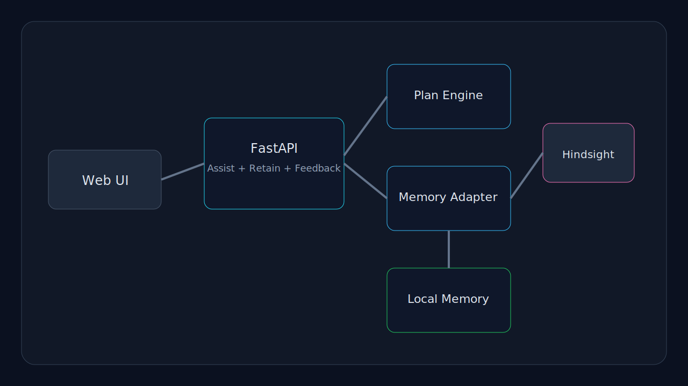
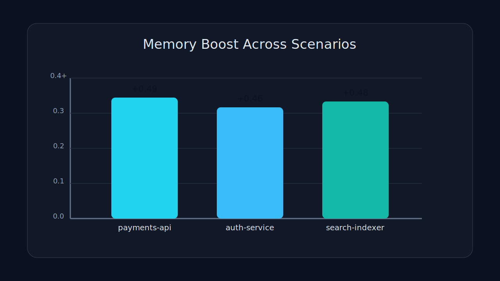

# Flashback Ops

Flashback Ops is a memory-first incident response copilot for engineering teams.  
It turns previous outages, fixes, and postmortem lessons into ranked recovery plans for the next incident in seconds.

## Why This Project Wins

| Judging Dimension | What This Project Demonstrates |
| --- | --- |
| Innovation (30%) | Side-by-side no-memory vs memory plan generation with quantified memory boost per incident query |
| Hindsight Memory (25%) | Pluggable Hindsight backend plus local persistent memory fallback, with explicit retain/recall loop and feedback capture |
| Technical Implementation (20%) | Typed FastAPI backend, modular memory adapters, deterministic scoring engine, tests, and simulation script |
| User Experience (15%) | High-clarity web console built for live demos with confidence deltas, recalled incidents, and feedback loop |
| Real-World Impact (10%) | Solves a costly DevOps workflow: faster triage, fewer repeated mistakes, and compounding organizational learning |

## Core Demo Story

1. Seed historical incidents.
2. Submit a fresh outage signal.
3. Watch the baseline plan (generic).
4. Watch the memory plan (specific, ranked, context-aware).
5. Save feedback so the next response gets better.

## Product Highlights

- Memory is the product, not an add-on.
- Recalled incidents are scored by service, symptoms, severity, tags, recency, and prior outcomes.
- Confidence delta makes the value of memory measurable in real time.
- Feedback from resolved incidents is retained as new memory.
- Hindsight backend mode is available with fallback so the demo still runs instantly.

## Architecture



## Tech Stack

- Python 3.11+
- FastAPI + Uvicorn
- Pydantic v2
- Vanilla JS frontend
- Optional Hindsight integration through REST endpoints

## Quick Start

```bash
python -m pip install -e .[dev]
powershell -ExecutionPolicy Bypass -File .\run.ps1
```

App URL: `http://127.0.0.1:8000`

## Environment Variables

| Variable | Default | Purpose |
| --- | --- | --- |
| `FLASHBACK_MEMORY_BACKEND` | `local` | `local` or `hindsight` |
| `FLASHBACK_DATA_FILE` | `data/memory.json` | Local memory persistence path |
| `FLASHBACK_MAX_RECALL` | `5` | Max recall candidates |
| `HINDSIGHT_BASE_URL` | empty | Hindsight API base URL |
| `HINDSIGHT_API_KEY` | empty | Hindsight auth token |
| `HINDSIGHT_BANK_ID` | `flashback-ops` | Memory bank identifier |

## API Endpoints

- `POST /api/seed` seed realistic incident memories
- `POST /api/incidents` retain one incident memory
- `POST /api/assist` generate baseline vs memory plan
- `POST /api/feedback` retain resolution feedback
- `GET /api/status` runtime snapshot
- `GET /api/memory/stats` memory distribution

## Quality Gates

```bash
python -m pytest -q --basetemp "C:\Users\Jeevan kumar\AppData\Local\Temp\flashback_pytest"
python scripts/evaluate_learning_curve.py
python scripts/live_demo_sequence.py
```

Reference simulation output:

- Scenario 1 memory boost: `+0.49`
- Scenario 2 memory boost: `+0.46`
- Scenario 3 memory boost: `+0.48`
- Average memory boost: `+0.477`



## Submission Assets

- Technical article: [`article.md`](article.md)
- LinkedIn post draft: [`docs/linkedin-post.md`](docs/linkedin-post.md)
- Video script and titles: [`docs/video-script.md`](docs/video-script.md)
- Project documentary: [`docs/project-documentary.md`](docs/project-documentary.md)
- Submission checklist: [`docs/submission-checklist.md`](docs/submission-checklist.md)
- API reference: [`docs/api-reference.md`](docs/api-reference.md)
- Presentation outline: [`docs/presentation-outline.md`](docs/presentation-outline.md)

## Team

- Team Name: `Solo Leveling11`
- Team Code: `af50adfd`
- Builder: `Jeevan Kumar`
